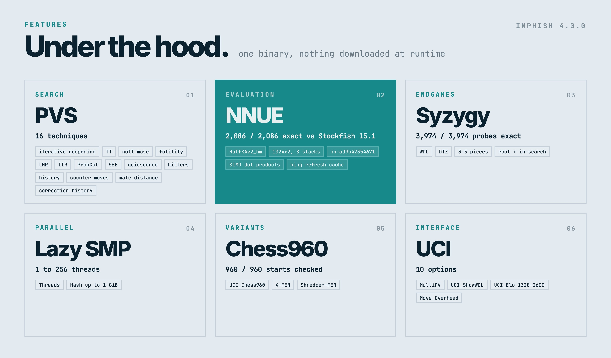
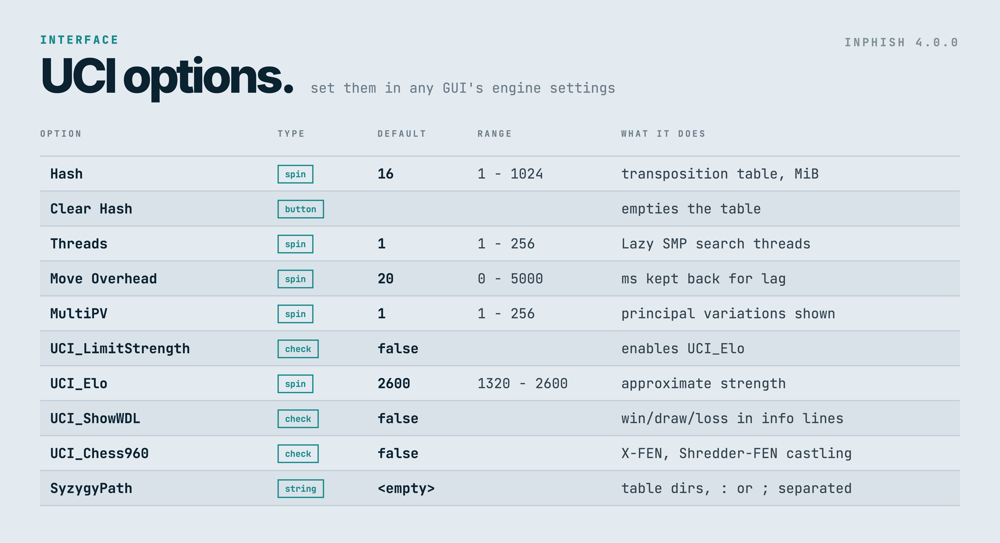
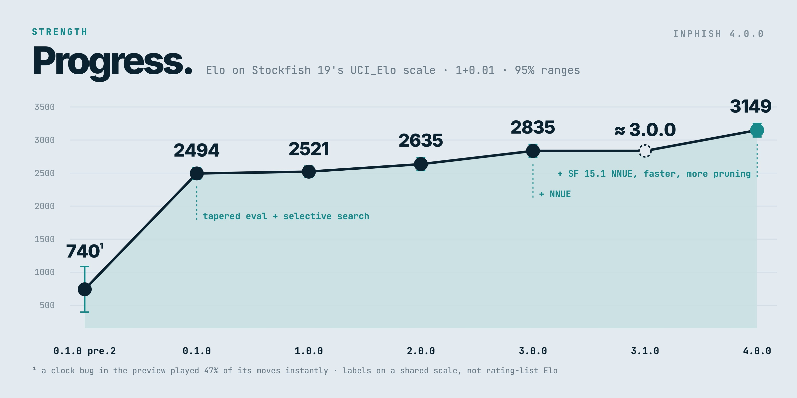
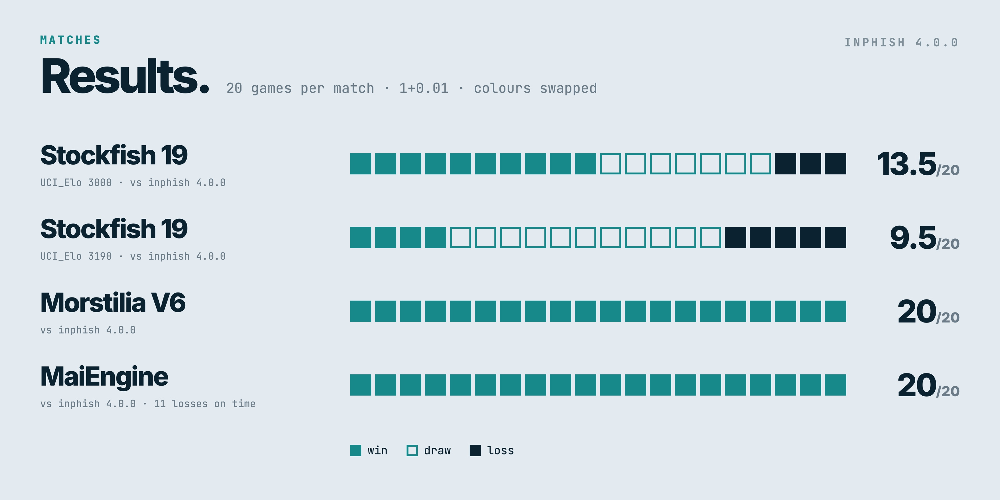
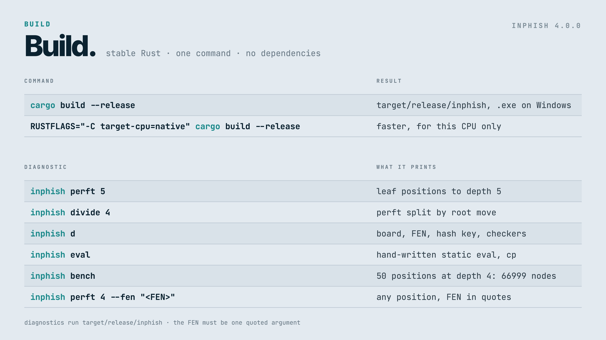

<p align="center">
  <a href="https://github.com/imInph/inphish/releases/latest"></a>
  <a href="LICENSE"></a>
</p>

inphish is a UCI chess engine written in Rust. It has no graphical interface of its own: run it inside a chess GUI or tournament manager, where it speaks UCI over standard input and output.

## Quick start

1. Download the archive for your system from [Releases](https://github.com/imInph/inphish/releases): Linux x86-64, Windows x86-64, `macos-aarch64` for Apple Silicon, or `macos-x86_64` for Intel Macs.
2. Extract it and select `inphish` (`inphish.exe` on Windows) as a UCI engine in your GUI.
3. Play, analyse or run matches. No book, network file or runtime download is needed.

On macOS, a downloaded binary may need `xattr -d com.apple.quarantine inphish` before a GUI can start it.

## Features



- **Search:** iterative deepening, principal variation search, a transposition table, null-move, futility, static-exchange and history pruning, ProbCut, late move reductions, internal iterative reductions, killer, history, counter-move and static-exchange move ordering, and quiescence search.
- **Evaluation:** since 4.0.0, Stockfish 15.1's NNUE network `nn-ad9b42354671` (HalfKAv2_hm, 1024x2 with eight layer stacks, GPL-3.0), bundled in the binary and run by inphish's own inference code, which matches Stockfish 15.1's output exactly. The evaluation is therefore Stockfish's network, not one of inphish's own. It makes the binary about 48 MB. 3.x used Stockfish 13's smaller `nn-62ef826d1a6d`.
- **Endgames:** Syzygy WDL and DTZ probing. The tables are not included; download them separately, for example the 3-5 piece set of about 1 GB.
- **Chess960:** with `UCI_Chess960` on, the engine accepts X-FEN and Shredder-FEN castling rights and reads and writes castling as the king capturing its own rook. Standard chess is the default.

### UCI options



<details>
<summary>Options as text</summary>

| Option | Default | Notes |
|---|---|---|
| `Hash` | 16 | Transposition table size in MiB, 1 to 1024 |
| `Clear Hash` | | Button |
| `Threads` | 1 | Lazy SMP, 1 to 256 |
| `Move Overhead` | 20 | Milliseconds reserved per move for GUI and network lag |
| `MultiPV` | 1 | Number of principal variations, 1 to 256 |
| `UCI_LimitStrength` | false | Enables `UCI_Elo` |
| `UCI_Elo` | 2600 | 1320 to 2600, approximate |
| `UCI_ShowWDL` | false | Adds win/draw/loss estimates to `info` output |
| `UCI_Chess960` | false | Chess960 castling and FEN handling |
| `SyzygyPath` | empty | One or more table directories, separated by `:` (`;` on Windows) |

</details>

## Strength

No rating-list Elo has been measured. Each release is placed on Stockfish 19's `UCI_Elo` scale: Stockfish was limited to a series of `UCI_Elo` settings, inphish played 20 games against each with the openings' colours swapped, and one Elo per version was fitted to all its results by maximum likelihood, with 95% ranges. Stockfish calibrates `UCI_Elo` at much longer time controls and its limiter does not scale with time the way a normal engine does, so treat the numbers as labels on a shared scale rather than ratings.



The large steps are the preview to 0.1.0, which added the tapered evaluation and selective search, 3.0.0, which added the NNUE network, and 4.0.0, which moved to Stockfish 15.1's larger network with faster move generation and more selective search. Between 0.1.0 and 2.0.0 the differences are within the ranges. 4.0.0 scored about even against Stockfish at its highest setting, 3190, so its figure rests on the top of the scale and is the least certain. Head-to-head matches between versions exaggerate the gaps: 1.0.0 scored 30 of 40 against 0.1.0, 3.0.0 scored 34.5 of 40 against 2.0.0, 3.1.0 scored 36 and 38.5 of 40 against 1.0.0 and 2.0.0, and 4.0.0 scored 32 of 40 against 3.1.2.



At 1+0.01 MaiEngine loses many games on time, so its results say little about playing strength; inphish lost no game on time.

<details>
<summary>Every release, both time controls</summary>

Compare versions within one column only. Match scores are wins / losses / draws over 20 games.

| Version | Elo, 1+0.01 | Elo, 10+0.1 | [Morstilia V6](https://github.com/ALPDM447/MorstiliaChessEngine) | [MaiEngine](https://github.com/Justmaii/MaiEngine) |
|---|---|---|---|---|
| [inphish v0.1.0 pre 2](https://github.com/imInph/inphish/releases/tag/v0.1.0-preview.2) | ~740 ± 345 (1) | 1712 ± 126 | 3 / 16 / 1 (2) | 2 / 18 / 0 (2) |
| [inphish v0.1.0](https://github.com/imInph/inphish/releases/tag/v0.1.0) | 2494 ± 90 | 2777 ± 152 | 19 / 0 / 1 (3) | 18 / 1 / 1 (3) |
| [inphish v1.0.0](https://github.com/imInph/inphish/releases/tag/v1.0.0) | 2521 ± 84 | | 18 / 0 / 2 | 20 / 0 / 0 (4) |
| [inphish v2.0.0](https://github.com/imInph/inphish/releases/tag/v2.0.0) | 2635 ± 97 | | 20 / 0 / 0 | 20 / 0 / 0 (4) |
| [inphish v3.0.0](https://github.com/imInph/inphish/releases/tag/v3.0.0) | 2835 ± 97 | | 18 / 0 / 2 | 20 / 0 / 0 (4) |
| [inphish v3.1.0](https://github.com/imInph/inphish/releases/tag/v3.1.0) | about 3.0.0 (5) | | 20 / 0 / 0 | 20 / 0 / 0 (4) |
| [inphish v4.0.0](https://github.com/imInph/inphish/releases/tag/v4.0.0) | 3149 ± 102 | | 20 / 0 / 0 | 20 / 0 / 0 (4) |

1. At 1+0.01 the preview's clock handling played 47% of its moves instantly without searching, so this measures that bug rather than the engine.
2. At 10+0.1, on a build of the preview's era rather than the tagged revision.
3. At 10+0.1. At 1+0.01 it scored 19 / 0 / 1 against Morstilia and 20 / 0 / 0 against MaiEngine, 18 of them MaiEngine time forfeits.
4. At 1+0.01 MaiEngine lost many of these on time (16, 17, 15, 12 and 11 games for 1.0.0, 2.0.0, 3.0.0, 3.1.0 and 4.0.0), so they say little about playing strength. inphish lost no game on time.
5. Not placed on the ladder separately; it scored 21.5 and 19.5 of 40 against 3.0.0, where few games reach five pieces.

</details>

See [docs/TESTING.md](docs/TESTING.md) for every match.

## Build



<details>
<summary>Commands as text</summary>

Use stable Rust:

```sh
cargo build --release
```

The executable is `target/release/inphish` (`inphish.exe` on Windows). Building for the local CPU can improve speed:

```sh
RUSTFLAGS="-C target-cpu=native" cargo build --release
```

### Diagnostic commands

```sh
target/release/inphish perft 5
target/release/inphish divide 4
target/release/inphish d
target/release/inphish eval
target/release/inphish bench
target/release/inphish perft 4 --fen "r3k2r/p1ppqpb1/bn2pnp1/3PN3/1p2P3/2N2Q1p/PPPBBPPP/R3K2R w KQkq - 0 1"
```

`perft` counts leaf positions, `divide` prints counts by root move, `d` prints the board and position state, and `bench` searches 50 fixed positions at depth 4. The command-line FEN must be quoted as one argument. The depth-4 bench signature is `66999` nodes.

</details>

## Testing

Correctness tests and their reference data are described in [docs/TESTING.md](docs/TESTING.md), and the engine architecture in [docs/ARCHITECTURE.md](docs/ARCHITECTURE.md). Some earlier search changes were measured by SPRT against preceding revisions; later changes are checked with short bounded matches recorded in the testing notes.

## Limitations

inphish has no opening book or pondering and no evaluation network of its own. Tablebase support covers WDL and DTZ tables; on Windows each table file used is read into memory rather than mapped. [docs/ROADMAP.md](docs/ROADMAP.md) lists what was and was not built against the original plan.

## Acknowledgements

The Chess Programming Wiki documents most of the techniques used here. The piece-square tables are Ronald Friederich's PeSTO tables as published on the wiki. The evaluation network `nn-ad9b42354671` and the HalfKAv2_hm architecture it uses, like the `nn-62ef826d1a6d` HalfKP network of 3.x, come from the [Stockfish](https://github.com/official-stockfish/Stockfish) project and its contributors, and are distributed under the GPL-3.0. The Syzygy probing code is ported from Stockfish 13's `tbprobe`, itself based on Ronald de Man's Syzygy tablebase code.

## License

GPL-3.0-or-later. See [LICENSE](LICENSE).
