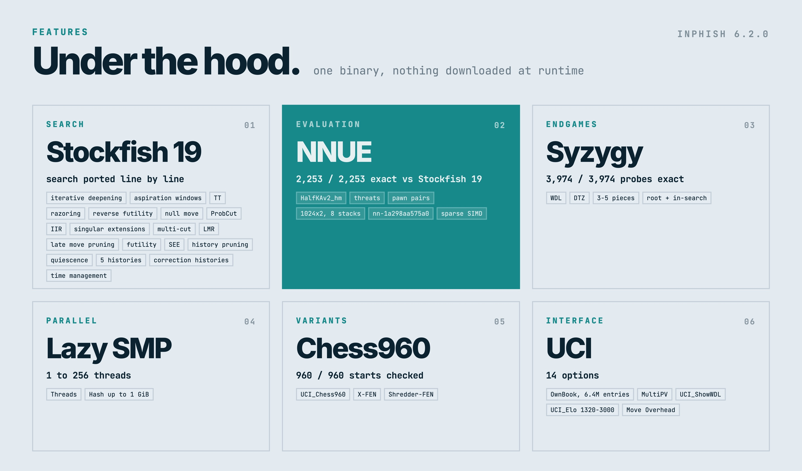
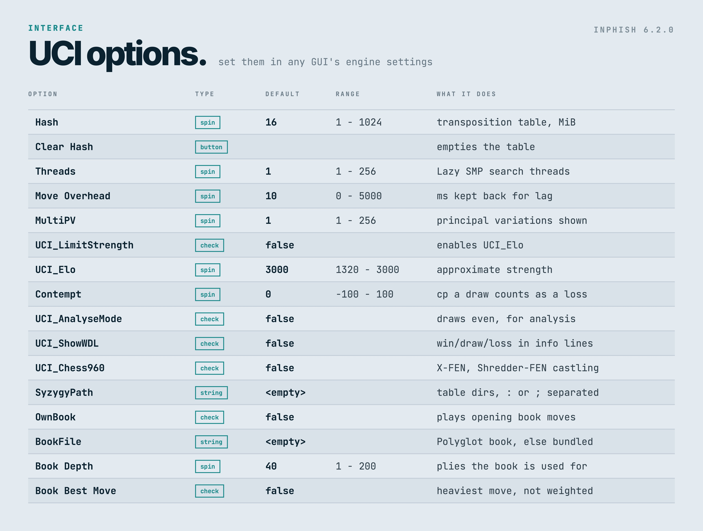
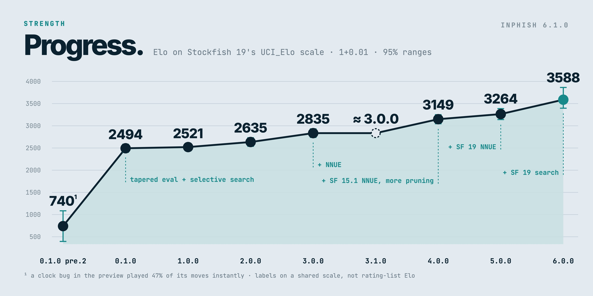
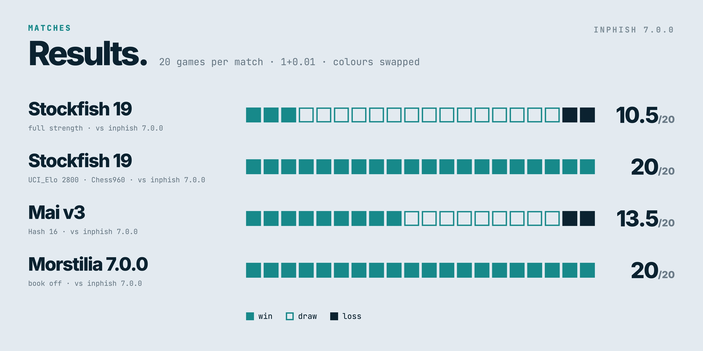
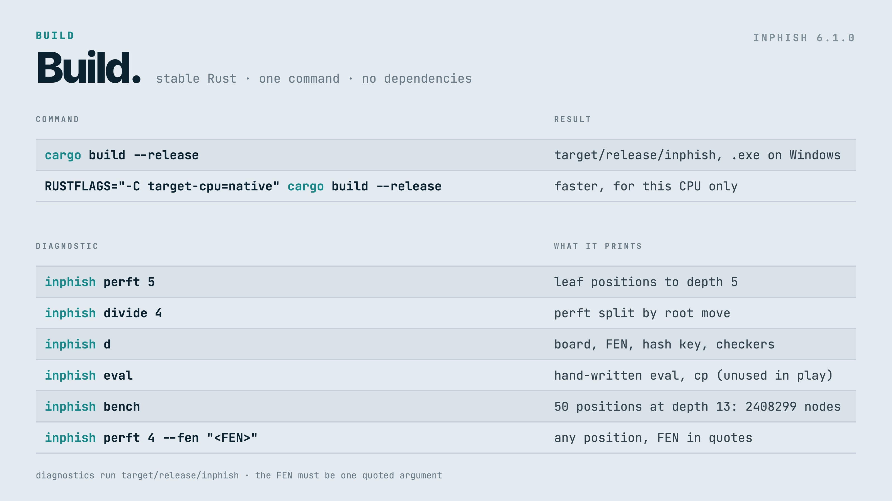

<p align="center">
  <a href="https://github.com/imInph/inphish/releases/latest"></a>
  <a href="LICENSE"></a>
</p>

inphish is a UCI chess engine written in Rust. It has no graphical interface of its own: run it inside a chess GUI or tournament manager, where it speaks UCI over standard input and output.

## Quick start

1. Download the archive for your system from [Releases](https://github.com/imInph/inphish/releases): Linux x86-64, Windows x86-64, `macos-aarch64` for Apple Silicon, or `macos-x86_64` for Intel Macs.
2. Extract it and select `inphish` (`inphish.exe` on Windows) as a UCI engine in your GUI.
3. Play, analyse or run matches. No book, network file or runtime download is needed.

On macOS, a downloaded binary may need `xattr -d com.apple.quarantine inphish` before a GUI can start it.

## Features



- **Search:** since 6.0.0, a port of Stockfish 19's search (GPL-3.0) onto inphish's own board and move generator: principal variation search with iterative deepening and aspiration windows, razoring, reverse futility, null-move pruning with verification, ProbCut, singular and multi-cut extensions, late move reductions and pruning, futility, history and static-exchange pruning, a staged move picker over butterfly, capture, continuation, pawn and low-ply histories, evaluation correction histories, quiescence search, Stockfish's time management and Lazy SMP thread voting.
- **Evaluation:** since 5.0.0, Stockfish 19's NNUE network `nn-1a298aa575a0` (piece-square, threat and pawn-pair inputs, 1024x2 with eight layer stacks, GPL-3.0), bundled in the binary and run by inphish's own inference code, which matches Stockfish 19's output exactly. The evaluation is therefore Stockfish's network, not one of inphish's own. It adds about 100 MB to the binary. 4.x used Stockfish 15.1's `nn-ad9b42354671` and 3.x Stockfish 13's `nn-62ef826d1a6d`.
- **Opening book:** since 5.0.0, a bundled Polyglot book of 6.4 million entries built from Lichess games between players rated 2000 and above (CC0), covering up to the first 40 plies. It is off by default; `OwnBook` turns it on, and `BookFile` loads any Polyglot book instead. With the network, the book brings the binary to about 200 MB. How it was built is recorded in [`crates/inphzugzwang-book/book/README.md`](crates/inphzugzwang-book/book/README.md).
- **Endgames:** Syzygy WDL and DTZ probing. The tables are not included; download them separately, for example the 3-5 piece set of about 1 GB.
- **Chess960:** with `UCI_Chess960` on, the engine accepts X-FEN and Shredder-FEN castling rights and reads and writes castling as the king capturing its own rook. Standard chess is the default.

### UCI options



<details>
<summary>Options as text</summary>

| Option | Default | Notes |
|---|---|---|
| `Hash` | 16 | Transposition table size in MiB, 1 to 1024 |
| `Clear Hash` | | Button |
| `Threads` | 1 | Lazy SMP, 1 to 256 |
| `Move Overhead` | 10 | Milliseconds reserved per move for GUI and network lag |
| `MultiPV` | 1 | Number of principal variations, 1 to 256 |
| `UCI_LimitStrength` | false | Enables `UCI_Elo` |
| `UCI_Elo` | 3000 | 1320 to 3000, approximate |
| `Contempt` | 0 | Centipawns by which a draw counts as worse than even for the engine, -100 to 100; off in analysis mode and with `UCI_LimitStrength` |
| `UCI_AnalyseMode` | false | Scores draws as even, for analysis |
| `UCI_ShowWDL` | false | Adds win/draw/loss estimates to `info` output |
| `UCI_Chess960` | false | Chess960 castling and FEN handling |
| `SyzygyPath` | empty | One or more table directories, separated by `:` (`;` on Windows) |
| `OwnBook` | false | Plays opening book moves in standard chess; not in analysis, pondering, `searchmoves` or `MultiPV` above 1 |
| `BookFile` | empty | A Polyglot book to use instead of the bundled one |
| `Book Depth` | 40 | Plies from the start of the game within which the book is used, 1 to 200 |
| `Book Best Move` | false | Always plays the book's heaviest move instead of choosing by weight |

</details>

## Strength

No rating-list Elo has been measured. Each release is placed on Stockfish 19's `UCI_Elo` scale: Stockfish was limited to a series of `UCI_Elo` settings, inphish played 20 games against each with the openings' colours swapped, and one Elo per version was fitted to all its results by maximum likelihood, with 95% ranges. Stockfish calibrates `UCI_Elo` at much longer time controls and its limiter does not scale with time the way a normal engine does, so treat the numbers as labels on a shared scale rather than ratings.



The large steps are the preview to 0.1.0, which added the tapered evaluation and selective search, 3.0.0, which added the NNUE network, 4.0.0, which moved to Stockfish 15.1's larger network with faster move generation and more selective search, 5.0.0, which moved to Stockfish 19's network with threat and pawn-pair inputs, and 6.0.0, which ported Stockfish 19's search. Between 0.1.0 and 2.0.0 the differences are within the ranges. 4.0.0 scored about even, 5.0.0 12.5 and 6.0.0 18.5 of 20 against Stockfish at its highest setting, 3190, so their figures rest on the top of the scale and are the least certain; 6.0.0's range runs from 3397 to 3864. Against Stockfish 19 at full strength 6.0.0 scored 8 of 20 (2 wins, 6 losses, 12 draws). 6.1.0 plays the same moves as 6.0.0, about 6% faster; it scored 20 of 20 at 3190, which puts it past the top of the scale, so it has no figure of its own, and 8.5 of 20 against Stockfish at full strength (2 wins, 5 losses, 13 draws). Head-to-head matches between versions exaggerate the gaps: 1.0.0 scored 30 of 40 against 0.1.0, 3.0.0 scored 34.5 of 40 against 2.0.0, 3.1.0 scored 36 and 38.5 of 40 against 1.0.0 and 2.0.0, 4.0.0 scored 32 of 40 against 3.1.2, 5.0.0 23 of 40 against 4.0.0, although it searches about half as many nodes per second, and 6.0.0 37.5 of 40 against 5.0.0. 6.1.0 scored 20 of 40 against 6.0.0, 34 of them draws, as expected for the same search a little faster. 6.2.0 ports the search changes of Stockfish's development build after Stockfish 19; it scored 20.5 of 40 against 6.1.0 and 8.5 of 20 against Stockfish 19 at full strength (no wins, 3 losses, 17 draws), and was not played at 3190.



At 1+0.01 MaiEngine and Mai V2 lose many games on time, so their results say little about playing strength; inphish lost no game on time. 6.1.0 also scored 20 of 20 against Morstilia V6, MaiEngine and Mai V2. 6.2.0 was checked against Stockfish 19, Mai v3 and the Morstilia 7.0.0 release only.

<details>
<summary>Every release, both time controls</summary>

Compare versions within one column only. Match scores are wins / losses / draws over 20 games.

| Version | Elo, 1+0.01 | Elo, 10+0.1 | [Morstilia V6](https://github.com/ALPDM447/MorstiliaChessEngine) | [MaiEngine](https://github.com/Justmaii/MaiEngine) | [Morstilia v7-pre](https://github.com/ALPDM447/MorstiliaChessEngine) | [Mai V2](https://github.com/Justmaii/MaiEngineV2) | [Mai v3](https://github.com/Justmaii/MaiEngineV3) | [Morstilia 7.0.0](https://github.com/ALPDM447/MorstiliaChessEngine/releases/tag/v7) |
|---|---|---|---|---|---|---|---|---|
| [inphish v0.1.0 pre 2](https://github.com/imInph/inphish/releases/tag/v0.1.0-preview.2) | ~740 ± 345 (1) | 1712 ± 126 | 3 / 16 / 1 (2) | 2 / 18 / 0 (2) | | | | |
| [inphish v0.1.0](https://github.com/imInph/inphish/releases/tag/v0.1.0) | 2494 ± 90 | 2777 ± 152 | 19 / 0 / 1 (3) | 18 / 1 / 1 (3) | | | | |
| [inphish v1.0.0](https://github.com/imInph/inphish/releases/tag/v1.0.0) | 2521 ± 84 | | 18 / 0 / 2 | 20 / 0 / 0 (4) | | | | |
| [inphish v2.0.0](https://github.com/imInph/inphish/releases/tag/v2.0.0) | 2635 ± 97 | | 20 / 0 / 0 | 20 / 0 / 0 (4) | | | | |
| [inphish v3.0.0](https://github.com/imInph/inphish/releases/tag/v3.0.0) | 2835 ± 97 | | 18 / 0 / 2 | 20 / 0 / 0 (4) | | | | |
| [inphish v3.1.0](https://github.com/imInph/inphish/releases/tag/v3.1.0) | about 3.0.0 (5) | | 20 / 0 / 0 | 20 / 0 / 0 (4) | | | | |
| [inphish v4.0.0](https://github.com/imInph/inphish/releases/tag/v4.0.0) | 3149 ± 102 | | 20 / 0 / 0 | 20 / 0 / 0 (4) | | | | |
| [inphish v5.0.0](https://github.com/imInph/inphish/releases/tag/v5.0.0) | 3264 ± 123 | | 20 / 0 / 0 | 20 / 0 / 0 (4) | 20 / 0 / 0 | 20 / 0 / 0 (6) | 0 / 17 / 3 (7) | |
| [inphish v6.0.0](https://github.com/imInph/inphish/releases/tag/v6.0.0) | 3588, 3397 to 3864 | | 20 / 0 / 0 | 20 / 0 / 0 (4) | 20 / 0 / 0 | 20 / 0 / 0 (6) | 6 / 1 / 13 (7) | |
| [inphish v6.1.0](https://github.com/imInph/inphish/releases/tag/v6.1.0) | past 3190 (8) | | 20 / 0 / 0 | 20 / 0 / 0 (4) | 20 / 0 / 0 | 20 / 0 / 0 (6) | 10 / 0 / 10 (7) | |
| [inphish v6.2.0](https://github.com/imInph/inphish/releases/tag/v6.2.0) | not placed (9) | | | | | | 8 / 1 / 11 (7) | 20 / 0 / 0 (10) |

1. At 1+0.01 the preview's clock handling played 47% of its moves instantly without searching, so this measures that bug rather than the engine.
2. At 10+0.1, on a build of the preview's era rather than the tagged revision.
3. At 10+0.1. At 1+0.01 it scored 19 / 0 / 1 against Morstilia and 20 / 0 / 0 against MaiEngine, 18 of them MaiEngine time forfeits.
4. At 1+0.01 MaiEngine lost many of these on time (16, 17, 15, 12, 11, 15, 15 and 9 games for 1.0.0, 2.0.0, 3.0.0, 3.1.0, 4.0.0, 5.0.0, 6.0.0 and 6.1.0), so they say little about playing strength. inphish lost no game on time.
5. Not placed on the ladder separately; it scored 21.5 and 19.5 of 40 against 3.0.0, where few games reach five pieces.
6. Morstilia v7-pre (its repository at `511a656`) and Mai V2 (`e5d71bc`) played with their own opening books off. Mai V2 lost 9 of these games on time against 5.0.0 and 3 each against 6.0.0 and 6.1.0; all the Morstilia games ended in checkmate. Earlier releases did not play them.
7. Mai v3 at Hash 16 like inphish, with its network file given by path. All games ended normally. 5.0.0 played it after release, on the same machine.
8. 20 of 20 against Stockfish at `UCI_Elo` 3190, the highest setting, so no finite figure fits; it plays the same moves as 6.0.0 about 6% faster.
9. Not played on the ladder, whose top rung, 3190, 6.1.0 had already won 20 to 0. It scored 20.5 of 40 against 6.1.0 and 8.5 of 20 against Stockfish 19 at full strength.
10. The published 7.0.0 release (macOS arm64 asset) with its opening book off. All games ended in checkmate.

</details>

See [docs/TESTING.md](docs/TESTING.md) for every match.

## Build



<details>
<summary>Commands as text</summary>

Use stable Rust:

```sh
cargo build --release
```

The executable is `target/release/inphish` (`inphish.exe` on Windows). Building for the local CPU can improve speed:

```sh
RUSTFLAGS="-C target-cpu=native" cargo build --release
```

### Diagnostic commands

```sh
target/release/inphish perft 5
target/release/inphish divide 4
target/release/inphish d
target/release/inphish eval
target/release/inphish bench
target/release/inphish perft 4 --fen "r3k2r/p1ppqpb1/bn2pnp1/3PN3/1p2P3/2N2Q1p/PPPBBPPP/R3K2R w KQkq - 0 1"
```

`perft` counts leaf positions, `divide` prints counts by root move, `d` prints the board and position state, `eval` prints the hand-written evaluation, which play no longer uses since 4.0.0, and `bench` searches 50 fixed positions at depth 13 (`bench N` for another depth). The command-line FEN must be quoted as one argument. The bench signature is `1457280` nodes.

</details>

## Testing

Correctness tests and their reference data are described in [docs/TESTING.md](docs/TESTING.md), and the engine architecture in [docs/ARCHITECTURE.md](docs/ARCHITECTURE.md). Some earlier search changes were measured by SPRT against preceding revisions; later changes are checked with short bounded matches recorded in the testing notes.

## Limitations

inphish has no pondering beyond the UCI plumbing and no evaluation network, search tuning or opening book statistics of its own: the network and the search's rules and constants are Stockfish's, and the book is built from Lichess games. Tablebase support covers WDL and DTZ tables; on Windows each table file used is read into memory rather than mapped. [docs/ROADMAP.md](docs/ROADMAP.md) lists what was and was not built against the original plan.

## Acknowledgements

The Chess Programming Wiki documents most of the techniques used here. The piece-square tables are Ronald Friederich's PeSTO tables as published on the wiki. The evaluation network `nn-1a298aa575a0` and the architecture it uses, like the `nn-ad9b42354671` network of 4.x and the `nn-62ef826d1a6d` HalfKP network of 3.x, come from the [Stockfish](https://github.com/official-stockfish/Stockfish) project and its contributors, and are distributed under the GPL-3.0. The search since 6.0.0 is a port of Stockfish 19's search, move ordering, histories, transposition-table rules, time management and thread voting, also GPL-3.0. The Syzygy probing code is ported from Stockfish 13's `tbprobe`, itself based on Ronald de Man's Syzygy tablebase code.

## License

inphish, Copyright (C) 2026 imInph.

This program is free software: you can redistribute it and/or modify it under the terms of the GNU General Public License as published by the Free Software Foundation, either version 3 of the License, or (at your option) any later version. It is distributed in the hope that it will be useful, but WITHOUT ANY WARRANTY; without even the implied warranty of MERCHANTABILITY or FITNESS FOR A PARTICULAR PURPOSE. See [LICENSE](LICENSE) for the full text of the GNU General Public License, version 3.

The bundled networks come from the Stockfish project and are GPL-3.0; the opening book is built from Lichess games released under CC0.
